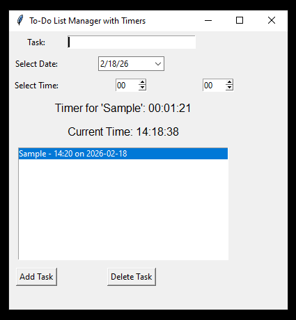

Here’s a clean, professional **README.md** for your To-Do List Manager with Timers project. I’ve included all important information, installation steps, usage instructions, dependencies, and optional troubleshooting tips.

---

````markdown
# To-Do List Manager with Timers

A simple **Python GUI application** for managing tasks with alarms and reminders.  
Built with **Tkinter** and **tkcalendar**, it allows users to add tasks with a specific date and time, and notifies them when the time is reached.

---

## Features

- Add tasks with **custom date and time**.
- Display a **countdown timer** for each task.
- Trigger notifications when the timer is up (popup + beep sound).
- Delete tasks from the list.
- Automatically adjusts alarms if the set time has already passed.
- Displays **current time** in real-time.
- Simple and intuitive **Tkinter GUI**.

---

## Screenshots


---

## Requirements

- Python **3.12** or higher (stable version recommended)  
- Modules:
  - `tkinter` (usually included in Python)
  - `tkcalendar`
  - `winsound` (built-in for Windows)

---

## Installation

1. **Install Python 3.12+**  
   Follow [this guide](https://www.python.org/downloads/windows/) to install Python for **all users** and ensure **Add Python to PATH** is checked.

2. **Install required modules**:  

   Open a terminal or VS Code terminal and run:

   ```bash
   pip install tkcalendar
````

> If pip is not recognized, use:

```bash
python -m pip install tkcalendar
```

---

## Usage

1. Open the project folder.

2. Run the program:

   ```bash
   python main.py
   ```

3. In the GUI:

   * Enter your task in the **Task** field.
   * Select a **date** using the calendar.
   * Set the **hour** and **minute** for the alarm.
   * Click **Add Task**.
   * To remove a task, select it from the list and click **Delete Task**.

4. The **timer label** will show the countdown for the next upcoming alarm.

5. When the alarm time is reached, a **popup message** appears and a **beep sound** plays 3 times.

---

## Notes / Known Issues

* The timer will **roll over to the next day** if the alarm time is in the past.
* The GUI uses Windows `winsound` for alarms; cross-platform audio is not implemented.
* Tasks are **not saved** after closing the program. (Optional enhancement: implement file/database storage)
* Make sure VS Code is using the **correct Python interpreter** (Python 3.12+).

---

## Optional: Virtual Environment Setup

It is recommended to use a virtual environment to isolate dependencies:

```bash
python -m venv venv
venv\Scripts\activate  # Windows
pip install tkcalendar
python main.py
```

---

## Troubleshooting

* **ModuleNotFoundError**: Ensure `tkcalendar` is installed in the environment VS Code is using.
* **pip not recognized**: Use `python -m pip install <package>` instead.
* **VS Code terminal uses wrong Python**:

  * Press `Ctrl+Shift+P → Python: Select Interpreter`
  * Choose `C:\Program Files\Python312\python.exe` (or your installed path)
* **Alarms not triggering**: Check that the system time matches the selected date/time.

